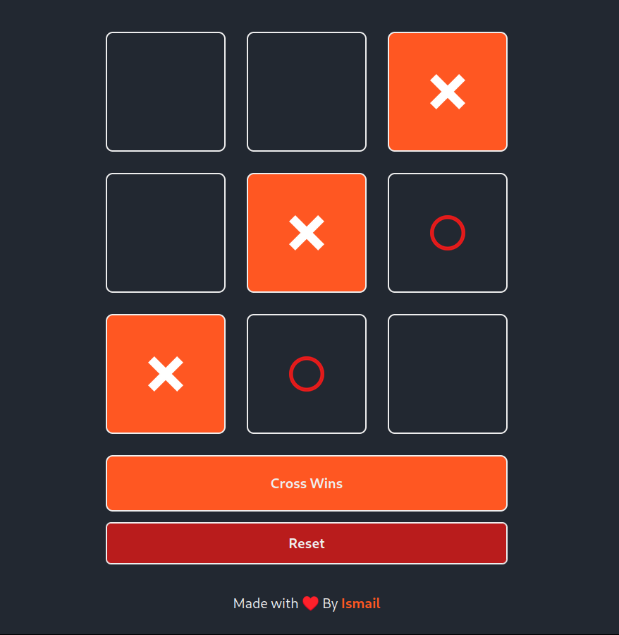

# React Tic-Tac-Toe Game
[Check it out](https://1sma31l.github.io/tictactoe-game)
<div style="width:80%; margin: auto;">

 
</div>
This is a simple Tic-Tac-Toe game implemented in React. The game features a 3x3 grid where two players take turns marking cells with either a circle or a cross. The game detects the winning combination and highlights the winning cells, and also handles the scenario of a draw.

## Features

- Two-player game with alternating turns.
- Detects winning combinations and highlights the winning cells.
- Displays a message indicating the winner or if the game is a draw.
- Reset button to restart the game.

## Technologies Used

- React
- Tailwind CSS

## Getting Started

Follow the instructions below to set up and run the project locally.

### Prerequisites

- Node.js (version 12 or higher)
- npm (version 6 or higher) or yarn

### Installation

1. Clone the repository:
   ```sh
   git clone https://github.com/1sma31l/tictactoe-game.git
   cd react-tic-tac-to
2.  Install the dependencies:
```sh
npm install
```
3. Running the project 

```sh
npm run dev
```
## Project Structure

    src/ - The source code directory.
        components/ - Contains the React components (Board and Cell).
        assets/ - Contains the image assets (cross.png and circle.png).
        App.js - The main application component.
        index.js - The entry point of the application.
    public/ - Contains the public assets and the main HTML file.
    
## Components

1. ### Board Component

The Board component manages the state of the game, including the cells, the current player's turn, and the winning combination. It also handles resetting the game.

2. ### Cell Component

The Cell component represents a single cell in the Tic-Tac-Toe grid. It handles the click event to mark the cell with either a circle or a cross and manages the hover state.

## Styling

The application uses Tailwind CSS for styling. The styles are defined using utility classes directly in the component files.

## Contributing

Contributions are welcome! If you find any issues or have suggestions for improvements, please open an issue or create a pull request.

